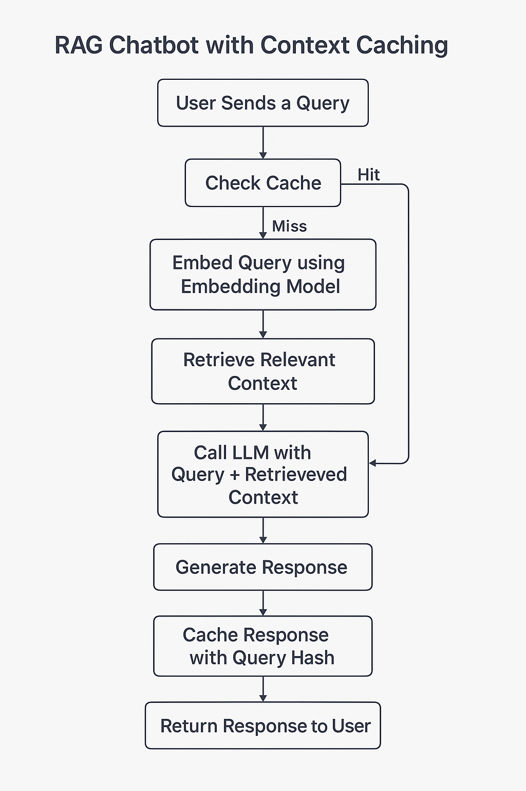

# Document-Genie-AI

Document Genie is a Retrieval-Augmented Generation (RAG) application that leverages Google's Generative AI framework to provide instant insights from your documents. It processes uploaded PDF files, breaks them down into manageable text chunks, and creates a searchable vector store. The project then uses semantic caching to improve performance and provide more accurate responses for similar queries.

## Features

- **Document Processing**: Upload multiple PDF files and extract their text.
- **Text Chunking**: Splits extracted text into smaller, manageable chunks to optimize vector creation.
- **Vector Store Creation**: Uses FAISS to build a searchable index over text chunks.
- **Semantic Caching**: Caches question embeddings and answers to quickly serve responses for repeated or similar queries.
- **Retrieval-Augmented Generation**: Leverages a generative AI model to answer questions by combining context from the processed documents with external queries.
- **Interactive Chat UI**: Built with Streamlit, enabling users to interactively ask questions and receive responses.

## How It Works

1. **Uploading Documents**:  
   Users can upload one or more PDF files through the web interface. The application extracts text from these documents using `PyPDF2`.

2. **Creating Text Chunks**:  
   The extracted text is split into smaller chunks using the `RecursiveCharacterTextSplitter` from LangChain. This ensures that the text is processed in manageable sizes.

3. **Generating Embeddings and Building a Vector Store**:  
   The project uses Google's Generative AI Embeddings to transform text chunks into vectors. These vectors are stored in a FAISS index, making them easily searchable.

4. **Semantic Caching for Faster Responses**:  
   When a question is asked, the system first checks if a similar question (based on cosine similarity of embeddings) already exists in the cache. If the similarity exceeds a predefined threshold, the cached answer is returned immediately, otherwise, the question is processed normally.

5. **Conversational Chain**:  
   The application uses a custom prompt with context about the document along with the user’s query. A generative model then produces a detailed answer based on both the input context and the pre-stored embeddings.

